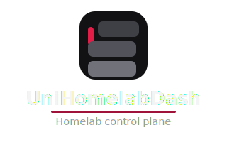
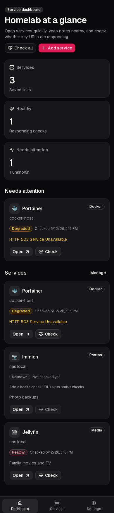
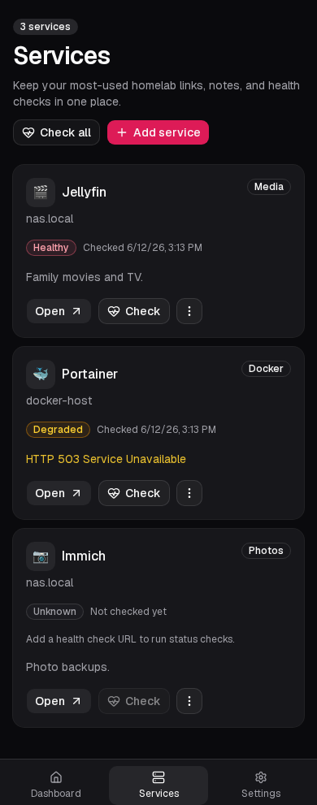
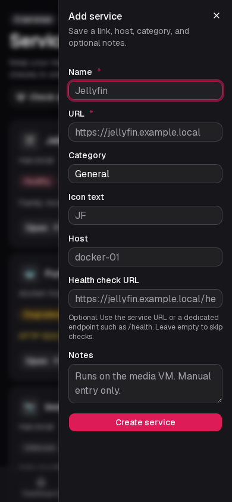

<p align="center">
  
</p>

# UniHomelabDash

Self-hosted homelab control plane — save your services, check health on demand, open everything from your phone.

Brand assets and palette: [docs/branding/BRAND.md](docs/branding/BRAND.md)

> **Security:** v0.1.0 has **no login**. Use on a trusted homelab network only. Do not expose to the public internet without a reverse proxy and access control (Authelia, VPN, etc.). See [SECURITY.md](SECURITY.md).

## Quick start (Docker)

```bash
docker compose up --build
```

Open [http://localhost:3000](http://localhost:3000). Rebuild after pulling changes so the image includes the latest UI and PWA assets.

The Compose file mounts a named volume at `/app/data` for SQLite persistence. It intentionally does not mount `/var/run/docker.sock`.

If port 3000 is already in use:

```bash
HOST_PORT=3003 docker compose up --build
```

Copy [.env.example](.env.example) for optional environment variables (`DATABASE_PATH`, `HOST_PORT`, `ALLOWED_DEV_ORIGIN`).

## Container Images

Public source code and releases: [github.com/uniskela/UniHomelabDash](https://github.com/uniskela/UniHomelabDash).

CI builds OCI images on every push to `main` and on version tags (`v0.1.0`, etc.) via [.github/workflows/docker-image.yml](.github/workflows/docker-image.yml) (GHCR and [Docker Hub](https://hub.docker.com/r/uniskela/unihomelabdash)) and [.github/workflows/ci.yml](.github/workflows/ci.yml) (app CI).

### Registries

| Registry | Image | Notes |
|----------|-------|--------|
| **GHCR** | `ghcr.io/uniskela/unihomelabdash` | Built by GitHub Actions |
| **Docker Hub** | `uniskela/unihomelabdash` | [hub.docker.com/r/uniskela/unihomelabdash](https://hub.docker.com/r/uniskela/unihomelabdash) — same tags as GHCR |

Either registry works for installs. Use whichever is easier on your network.

### Tags

The same tags are published to GHCR and Docker Hub:

| Tag | When published | GHCR | Docker Hub |
|-----|----------------|------|------------|
| `latest` | Every push to `main`; also updated on release tags | `ghcr.io/uniskela/unihomelabdash:latest` | `uniskela/unihomelabdash:latest` |
| `vX.Y.Z` | Git tag `vX.Y.Z` | `ghcr.io/uniskela/unihomelabdash:v0.1.0` | `uniskela/unihomelabdash:v0.1.0` |
| `X.Y.Z` | Same release (semver without `v` prefix) | `ghcr.io/uniskela/unihomelabdash:0.1.0` | `uniskela/unihomelabdash:0.1.0` |

Pin a release with either `v0.1.0` or `0.1.0` — both point at the same image.

### docker run

GHCR:

```bash
docker pull ghcr.io/uniskela/unihomelabdash:latest
docker run -d --name unihomelabdash \
  -p 3000:3000 \
  -v unihomelabdash-data:/app/data \
  --restart unless-stopped \
  ghcr.io/uniskela/unihomelabdash:latest
```

Docker Hub:

```bash
docker pull uniskela/unihomelabdash:latest
docker run -d --name unihomelabdash \
  -p 3000:3000 \
  -v unihomelabdash-data:/app/data \
  --restart unless-stopped \
  uniskela/unihomelabdash:latest
```

### docker-compose (pre-built image)

Use `image` instead of `build` (for example in `docker-compose.override.yml`):

```yaml
services:
  unihomelabdash:
    image: ghcr.io/uniskela/unihomelabdash:latest
    # image: uniskela/unihomelabdash:latest  # Docker Hub
    container_name: unihomelabdash
    ports:
      - "${HOST_PORT:-3000}:3000"
    environment:
      DATABASE_PATH: /app/data/unihomelabdash.sqlite
    volumes:
      - unihomelabdash-data:/app/data
    restart: unless-stopped

volumes:
  unihomelabdash-data:
```

### CI secrets (GitHub)

| Secret | Required | Purpose |
|--------|----------|---------|
| `REGISTRY_USERNAME` | Optional | GitHub username for GHCR (defaults to the workflow actor) |
| `REGISTRY_TOKEN` | Optional | GitHub PAT with `write:packages` (defaults to the automatic workflow token) |
| `DOCKERHUB_USERNAME` | For Docker Hub push | Docker Hub namespace (`uniskela`) |
| `DOCKERHUB_TOKEN` | For Docker Hub push | Docker Hub access token |

Secret names must be alphanumeric or underscore only, and cannot start with `GITHUB_`. Use `REGISTRY_TOKEN` for a custom GHCR PAT — not `GITHUB_TOKEN`.

For the first GHCR push, set **Settings → Actions → General → Workflow permissions → Read and write permissions**.

### Maintainer-only: internal infrastructure

The project maintainer may also build images to a **private** self-hosted Gitea registry on an internal network (LAN/Tailscale only). This is **not** a public distribution channel — contributors and users should use GitHub, GHCR, or Docker Hub only.

- Workflow: [.gitea/workflows/docker-image.yml](.gitea/workflows/docker-image.yml)
- Internal registry image: `git.pike.homes/alex/unihomelabdash` (reachable only on maintainer network)
- Secrets: `REGISTRY_USERNAME`, `REGISTRY_TOKEN` (Gitea package write)

Do not document or share internal hostnames in issues, PRs, or release notes intended for the public.

## What it does

- Mobile-first dashboard with service cards and health status
- Manual service links with categories, hosts, icons, and notes
- On-demand HTTP health checks with last-checked timestamps
- Installable PWA (home screen / desktop shortcut)
- SQLite persistence and Docker Compose deployment

## What it does not do (yet)

- Authentication or multi-user access
- Docker, Portainer, or Proxmox integrations
- Push notifications or alerts
- Automatic background health polling

## Screenshots

| Dashboard | Services |
|-----------|----------|
|  |  |

| Add service form |
|------------------|
|  |

Demo data only (`example.local` URLs). Regenerate after UI or branding changes:

```bash
npm run icons:export   # when brand SVG assets change
npm run build
npm run screenshots
```

## Health checks

When adding or editing a service, set an optional **health check URL**. Use the service root or a dedicated endpoint (for example `/health`). Tap **Check** on a card or **Check all** on the dashboard.

Behaviour in v0.1.0:

- **GET** requests only, **5 second** timeout
- HTTP **2xx–3xx** responses count as healthy; other codes show as degraded with the status message
- Checks run **on demand** when you tap Check — there is no background polling
- The UniHomelabDash server must be able to reach the URL from the host or container
- LAN-only hostnames work when the app runs on the same network

Edit and delete services from the **Services** page (overflow menu on each card). The dashboard is for quick open and health overview.

## Development

```bash
npm install
npm run dev
```

Open [http://localhost:3000](http://localhost:3000).

Manual services are stored in SQLite at `data/unihomelabdash.sqlite` by default. Set `DATABASE_PATH` to use a different location.

### LAN / phone testing (dev)

```bash
npm run dev:lan
```

Then open `http://<your-host-ip>:3004` (find your IP with `hostname -I` or `ip a`).

Next.js blocks cross-origin dev assets by default. This project configures `allowedDevOrigins` in `next.config.ts` for common private LAN ranges. If you still see `webpack-hmr` WebSocket errors:

```bash
ALLOWED_DEV_ORIGIN=192.168.0.7 npm run dev:lan
```

See the [Next.js allowedDevOrigins docs](https://nextjs.org/docs/app/api-reference/config/next-config-js/allowedDevOrigins).

For production-like testing without HMR:

```bash
npm run build && npm run start:lan
```

## Scripts

```bash
npm run dev          # local development (port 3000)
npm run dev:lan      # dev server on 0.0.0.0:3004 for LAN testing
npm run lint
npm run typecheck
npm run build
npm run start:lan    # production server on 0.0.0.0:3004
npm run db:generate
npm run screenshots  # capture docs/screenshots (requires build)
```

## Security

Authentication is planned for Phase 4. This build has no privileged integrations.

- Do not expose to the internet without proxy auth — see [SECURITY.md](SECURITY.md)
- Health checks perform server-side HTTP requests to URLs you configure
- Secrets must remain server-side only; do not store API tokens in service fields

## Contributing

Contributions are welcome. Start with [CONTRIBUTING.md](CONTRIBUTING.md) for setup, PR expectations, and scope rules.

- [ROADMAP.md](ROADMAP.md) and [ARCHITECTURE.md](ARCHITECTURE.md) explain project direction and technical decisions
- [AGENTS.md](AGENTS.md) holds principles, safety rules, and guidance for contributors and AI-assisted work
- Report security issues via [SECURITY.md](SECURITY.md) and [GitHub Security Advisories](https://github.com/uniskela/UniHomelabDash/security/advisories/new)

## License

MIT — see [LICENSE](LICENSE).
